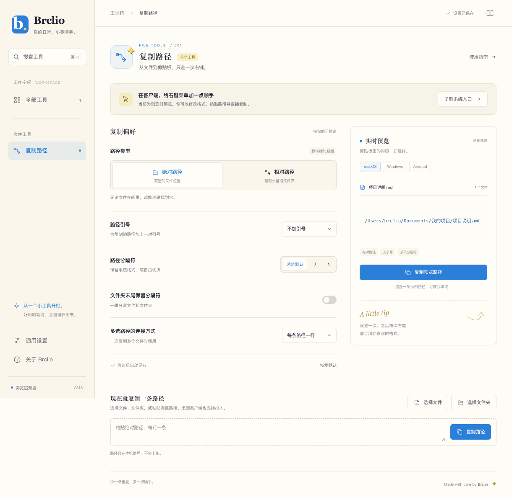

# Brclio

让日常的小事，变得顺手一点。Windows、macOS、Android 共用界面的本地工具软件，首个功能是**复制文件和文件夹路径**。

[下载安装包](https://github.com/Brclio/Brclio/releases/latest) · [发布记录](https://github.com/Brclio/Brclio/releases)



## 主要功能（v0.1.2）

- Windows 资源管理器右键菜单：文件、文件夹及文件夹空白处；Windows 11 在“显示更多选项”中使用。
- macOS Finder 第一层右键菜单“复制路径 · Brclio”：支持文件、文件夹、多选及文件夹空白处；软件关闭时也可调用。
- Android 系统文件 / 文件夹选择器、文件管理器分享入口和应用内长按复制。
- 默认绝对路径、不带引号；可配置相对路径及基准文件夹、文本引号、分隔符、目录末尾分隔符和多选连接方式。
- 实时输出预览、桌面拖入文件、手动粘贴多条路径、本机自动保存偏好。
- 在线检查 GitHub 新版本、下载安装包、显示进度、SHA-256 校验、进入系统安装流程。

设置 → 版本更新 → 检查新版本。更新仅从本仓库的稳定版 Release 获取，用户点击下载后才下载；校验未通过的安装包不会进入安装流程。

## 下载与安装

| 平台 | 安装包 | 安装方式 |
| --- | --- | --- |
| Windows x64 | `Brclio-版本-windows-x64.exe` | 运行安装向导，可选择安装目录 |
| macOS Apple Silicon | `Brclio-版本-mac-arm64.dmg` | 打开 DMG，将 Brclio 拖入 Applications |
| macOS Intel | `Brclio-版本-mac-x64.dmg` | 打开 DMG，将 Brclio 拖入 Applications |
| Android 8.0+ | `Brclio-版本-android.apk` | 允许当前来源安装应用，交给系统安装器 |

macOS 从 v0.1.1 起使用完整的 ad-hoc 应用签名，修复 v0.1.0 的“应用已损坏”打包缺陷；目前尚无 Developer ID 签名和 Apple 公证。首次打开可能提示无法验证开发者：先尝试打开，再到 **系统设置 → 隐私与安全性 → 仍要打开**，确认“打开”。这是对 Brclio 单个应用的允许，详见 [Apple 官方说明](https://support.apple.com/zh-cn/102445)。如果仍提示“已损坏”，请确认已替换为 v0.1.1 或更新版本。

从 v0.1.3 起，在设置中检查版本后点击“下载并安装更新”，macOS 和 Windows 会校验安装包、覆盖当前安装目录并自动打开新版，保留偏好和右键菜单。只有新版界面完成初始化、版本与进程确认成功后才清理旧版备份；启动失败会尝试恢复并重新打开旧版。安装目录不可写时会在退出软件前报错。

v0.1.2 及更早版本还没有自动覆盖安装能力，首次升级到 v0.1.3 需退出旧版后手动安装一次，后续版本即可使用新流程。Windows 尚未配置 Authenticode 发行签名。macOS 尚未公证，系统可能要求允许本应用打开。Android APK 使用项目固定的私有发布密钥签名，更新需沿用同一密钥，并由用户确认系统安装；安装完成尝试自动打开，受系统限制时点击安装器的“打开”。

右键入口默认关闭。在软件的“复制路径”页面点击“启用右键菜单”，可随时停用。macOS 请先将 v0.1.2 或更新安装版放入 Applications 并打开；如果 Finder 菜单未显示，在系统设置中搜索“扩展”，允许 Brclio 的 Finder 扩展（部分系统版本归在“文件提供程序”中），再返回软件重新启用。移动了桌面软件的位置后，可在软件中修复入口。Windows 系统菜单目前仅针对单个项目，软件内与 macOS 支持多项路径复制。

macOS 从 v0.1.2 起改用 Finder Sync 第一层菜单。新入口启用成功或停用集成时，会自动移除旧版由 Brclio 安装且带归属标记的 `Brclio Copy Path.workflow` 服务；未带该标记的同名工作流和其它服务会保留。Finder 的部分特殊、虚拟或云盘视图可能不显示扩展菜单，多个 Finder 扩展覆盖同一目录时也可能冲突；具体以当前系统中的实际菜单为准，详见[桌面端说明](docs/desktop.md)。

## 路径规则

绝对路径示例：`C:\Users\Brclio\Documents\项目\说明.md`、`/Users/brclio/Documents/项目/说明.md`。

选择相对路径后，以用户指定的绝对基准文件夹计算。例如基准为 `C:\Projects`，文件为 `C:\Projects\demo\README.md`，结果为 `demo\README.md`。跨磁盘、跨网络共享或无法确定真实路径的 URI 会明确报错，不会静默输出错误的相对路径。

Android 的云盘和部分文件管理器仅提供 `content://...`。Brclio 原样保留并标记真实 URI；已知的主共享存储文档才映射为 `/storage/emulated/0/...`。Android 无跨所有文件管理器的统一右键扩展，所以提供选择、分享和应用内长按入口。

引号设置只包装路径文本，不是终端命令的转义工具。复制路径不读取文件内容，不上传文件，也不需要登录账号。

## 本地运行

需要 Node.js 22 或更新版本。

```sh
npm ci
npm start
```

浏览器预览（浏览器不允许读取本机文件的完整路径，可粘贴路径测试）：

```sh
npm run dev
```

打开 `http://127.0.0.1:4173`。`web/index.html` 也可在执行 `npm run sync` 后直接打开，全部界面资源均在本地。

## 验证与构建

```sh
npm test
npm run test:ui       # 先启动 npm run dev；默认使用本机 Chrome
npm run test:hosts    # 启动独立临时服务，验证跨端桥接协议
npm run test:updates  # 更新下载、校验失败重试、进度与安装入口验证
npm run test:desktop  # 真实 Electron / 剪贴板 / 重启验证，自动还原剪贴板
npm run build:mac
npm run build:win
```

浏览器验证可通过 `BRCLIO_CHROME` 指定 Chrome / Chromium 可执行文件。桌面原生烟测会使用独立临时用户目录，不安装主机右键菜单。

Android 构建需要 JDK 17、Android SDK 35，详见 [Android 文档](docs/android.md)。Release 需显式配置签名，缺少签名时构建会失败；不把 debug APK 标为正式版。

## 项目结构

```text
core/       零依赖共享路径格式引擎
web/        Brclio 品牌界面、工具导航、偏好和平台桥接
desktop/   Electron 客户端、系统菜单、设置和在线更新
android/    Kotlin 原生入口、离线 WebView、系统选择器与安装器
scripts/    资源同步、验证、校验清单
.github/    持续集成与三端发布流程
```

各平台适配层与路径引擎分离，后续工具可以独立增加。配置和更新状态保存在本机；联网仅用于用户触发的版本检查、更新信息读取和安装包下载。

## 设计与署名

界面从 [Brclio Design System](https://github.com/Brclio/brclio-design-system) 的 App 模板改造，使用暖色背景、品牌蓝 / 黄 / 红、衬线标题和紧凑的工具布局。设计素材及对应衍生设计遵循 **CC BY-NC-SA 4.0**。

© 2026 Brclio · 黄家宝。写代码，教编程，做产品。
